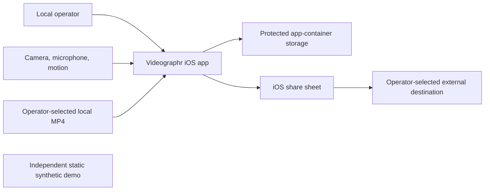
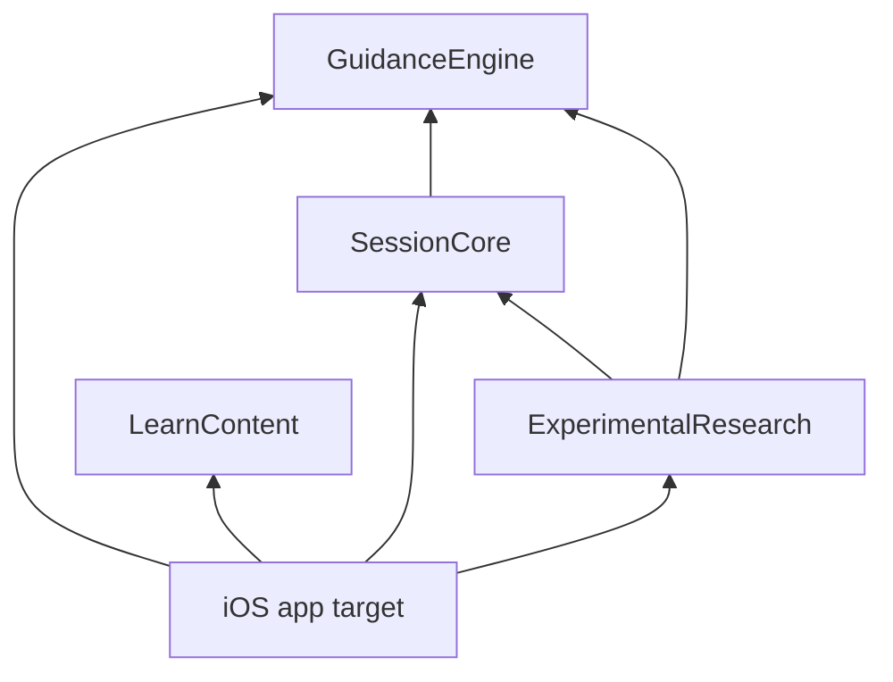
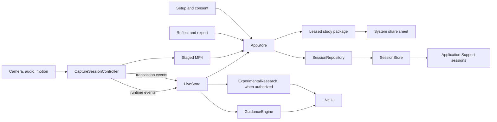

# Architecture

Videographr is a local-first iOS and iPadOS classroom-video alpha. It takes
session and consent metadata, camera, microphone, motion, and local MP4 inputs,
and produces local recordings, durable session metadata, observations, human
reflection notes, and consent-scoped metadata exports. There is no backend,
account system, synchronization, or media upload path.

This document is the source of truth for component ownership, dependency
direction, and the runtime flows that maintainers must preserve.

## System context

The native app is the only product runtime. The static demo is an independent
walkthrough with synthetic in-memory state. The system share sheet is the only
implemented path that can move app-created data outside the app container, and the
app does not control what the selected provider does next.

## SwiftPM boundaries

| Target | Responsibility | Dependencies |
| --- | --- | --- |
| `GuidanceEngine` | Pure direct observability: frame, CV, orientation, motion, audio level metering, availability, filming-tip prioritisation, and evidence-safe wording | None |
| `SessionCore` | Durable session model and persisted formats. `Domain`: value types, consent, transitions, codecs (`SessionCoding`), runtime facts copied into take manifests. `Application`: readiness, recording admission, the recording state machine, the repository protocol. `Persistence`: `SessionStore`, journals, reconciliation, study-package writing, leases and directory checks (`StudyPackageWriter`, `StudyPackageDirectory`) | `GuidanceEngine` |
| `ExperimentalResearch` | Explicitly unvalidated scene, coding, and rule-hypothesis algorithms, the live `ExperimentalAnalysisSession`, research-report adapters, and Gaussian geometry | `GuidanceEngine`, `SessionCore` |
| `LearnContent` | Independent German method, technology, and external-device catalogue | None |

Dependencies point from durable and experimental consumers toward the direct
observability boundary, never back into them. `GuidanceEngine` may describe only
what is directly observed or unavailable. `ExperimentalResearch` may derive
research hypotheses, but that output is not a validated measure and must not
control readiness, consent, or export authority. Its optional reflection aids stay
labeled and separate from human-authored notes.

`SessionCore` depends on `GuidanceEngine` only because readiness combines direct
signals with session authorization. Research DTOs such as `ResearchCodingSnapshot`
and `TeachingSituationID` live in `SessionCore` because they are part of the
persisted `session.json` and `coding-snapshots.jsonl` formats; the algorithms that
produce them stay in `ExperimentalResearch`. The `Domain`, `Application`, and
`Persistence` folders share one module; `scripts/verify_architecture.py` keeps
filesystem access out of `Domain`.

Two deliberate residuals remain. `CodingSegmentTimeline.observe` is replayed
whenever `SessionStore` merges the coding journal, so changing that segmentation
changes derived data in `session.json`. The capture Vision bridge also runs
`ClassroomLayoutAnalyzer` and takes its Vision sampling cadence from the selected
teaching-situation preset in every mode. Only `ExperimentalResearch` reads the
resulting layout geometry, so it never reaches readiness, consent, or export.

## iOS app boundaries

`UnterrichtsvideographieApp` is the composition root. It creates one durable
`AppStore` and one transient `LiveStore(appStore:)`, then injects both into the
five-tab SwiftUI shell. `AppStore` begins in an explicit loading state while its
persistence actor reconciles artifacts and loads the saved session. The shell
shows recovery progress or a retryable error before exposing session workflows, so
placeholder state cannot be saved while recovery is incomplete.

| Area | Responsibility |
| --- | --- |
| `Application/AppStore*` | Active session, reconciliation, autosave, local persistence, recording preparation and attachment, import, deletion, and export workflow. The only writer of the active session |
| `Application/MediaInspector`, `BuildProvenanceFactory` | Media inspection and the single composition of persisted algorithm versions |
| `Capture/LiveStore*` | Main-actor transient preview, authorization, runtime status, published guidance and experimental output, and typed capture-event reduction |
| `Capture/CaptureSessionController*`, `FrameSampler`, `MotionService`, `Vision*` | AVFoundation session, device queues, callbacks, recording artifact lifecycle, Vision bridge, and motion integration |
| `Capture/SpokenAudioCheck/` | The spoken audio playback check: recorder, player, and protected temporary file |
| `Live/`, `Setup/`, `Reflect/`, `Learn/`, `Info/`, `Design/` | Feature-specific SwiftUI and presentation only |

`AppStore.session` is read-only outside `AppStore`. Views and tests change it
through `edit(_:)` (which marks the draft dirty), `binding(_:)`, or intent methods;
loads and persisted results use `replaceSession(_:)`. Domain rules for those edits,
such as consent replacement and the experimental-mode transition, are `CaptureSession`
methods in `SessionCore`, and recording admission is `RecordingAdmission`. App code
outside `Application/` reaches persistence only through `AppStore`; the capture
controller receives a `RecordingArtifactSecuring` handle for securing or discarding
staged media.

`CaptureSessionController` never mutates view state. It emits two value-event
lanes to `LiveStore`:

- Runtime events are generation-scoped and may be coalesced: lifecycle,
  negotiated format, capacity, frame analysis, and audio samples. A generation
  check rejects samples from an inactive capture run.
- Transaction events are ordered and carry a `RecordingTransaction`: begin,
  finalizing, finish, rollback, stop request, and failure. Identity checks and
  durable attachment keep late callbacks from changing a later recording.

The lanes differ because preview data is replaceable, while a recording lifecycle
fact changes durable artifact ownership and must be processed in order.

## Principal runtime flows

For a recording, `AppStore` freezes the applicable authorization, transaction,
asset, destination, and provenance before AVFoundation starts. Finalized media is
inspected and attached only to the matching transaction and session. Stale or
already-terminal transitions are no-ops. Startup reconciliation keeps explicit
incomplete or unknown outcomes instead of silently reporting success. Committed
imported assets are recognized from their owning session metadata, so recording
reconciliation does not mistake them for session-named capture files.

Direct guidance and experimental windows update on separate paths. Motion updates
refresh technical guidance at a maximum routine rate of 5 Hz, with an immediate
refresh when critical orientation or motion boundaries change. Only a newly
accepted Vision analysis advances the scene and coding windows. Experimental
evaluation can consume the already computed direct result instead of evaluating it
a second time. The `frame-windows-v2` provenance suffix identifies the changed
temporal sampling.

Vision requests are reused on the video queue, and fallback results include only
requests in the successful set. Cached CV never advances research windows and
becomes unavailable once it ages out. Luminance scratch buffers are reused. Audio
is metered for every buffer, and peak, maximum per-buffer clipping fraction, and
dropout evidence are published at up to 10 Hz. Route state updates on route
changes, and audio-buffer storage grows only as needed.

Readiness consumes direct `GuidanceEngine` output, audio readiness, and durable
session authorization. Experimental processing is gated separately and is not a
readiness input. During an authorized experimental recording, labeled snapshots
may be appended to the bounded research journal.

## Storage, authorization, and export

`SessionStore` defaults to the app container's Application Support location at
`Unterrichtsvideographie/Sessions`. It persists session JSON, media references,
and bounded observation and coding journals locally. `AppStore` reconciles known
artifacts at startup and performs persistence away from the main actor.

Ordinary autosaves upsert the affected session summary and retain media-lookup
results, including missing files, until the media signature changes. Session and
save identities prevent late completions from replacing a newer draft, and a
superseded autosave schedules a fresh save when the active draft still needs
persistence. Repeated export-package invalidations are coalesced while active
share leases are retained.

Imports pin a non-symlink regular-file descriptor and reserve transaction-owned
staging under the store queue. Bulk copying runs outside the shared persistence
lane, while promotion and rollback stay serialized. Active reservations are
excluded from recovery cleanup, and a cancelled or failed inspection rolls back
the uncommitted copy without deleting the import source.

Observation writes revalidate collection consent from session metadata inside the
same serialized operation as the journal append. They do not hydrate prior
observation or coding history just to authorize a new row.

Evidence-safe mode is the default. Experimental mode requires usable, persisted
protocol metadata and adds research-processing consent to the relevant durable
authorization checks. Experimental output stays explicitly labeled and cannot
authorize capture or sharing.

The exported UTI is `de.videographr.study` with extension `.videographrstudy`.
Every package is metadata-only and contains `manifest.json`, `session.json`,
`annotations.jsonl`, `observations.jsonl`, and `coding-snapshots.jsonl`. The
manifest requires exactly the four non-manifest content files, their SHA-256
digests, session identity, scopes, mode, and provenance. Recorded and imported MP4
files remain outside the package. Temporary packages are leased while a share
result is pending, and the durable export outcome stays in local session state.

The package is metadata-only, not anonymous. Depending on the session and the
authorized scopes, its metadata can include context, pseudonyms, consent and media
metadata, free text, annotations, observations, experimental snapshots, and
provenance. The app records an attempted share before presenting the system share
sheet, but a share result is not proof of delivery and cannot revoke a copy an
external provider retains.

Retention values are durable policy metadata. No scheduled job deletes an expired
session. Session deletion removes the validated copy the app owns; it does not
remove an operator's import source or an already shared copy.

The app target bundle identifier is `de.videographie.Unterrichtsvideographie`. The
public display name is Videographr, while `Unterrichtsvideographie` remains the
package, target, and scheme identifier.

## Reflection presentation

The SwiftUI shell shares neutral graphite surfaces, readable signal labels, and
flat controls across session preparation, capture, and reflection. At regular
width, capture uses the full window and a session menu retains access to the
reference catalogue and app information. Compact windows keep bottom navigation,
which becomes a menu at accessibility text sizes. Capture details, including the
spoken audio check and explicit override, stay available in a separate inspection
sheet.

Reflection validates media availability whenever the session or asset list
changes. A newly attached first asset configures playback while the view remains
open. Player time observation updates only the playback controls and the displayed
position, and annotation groups are derived once per content render. File badges
report checked availability, and Setup leaves device capacity explicitly unchecked
until Live performs its pre-take checks.

The annotation editor accepts a human note, an author pseudonym, and a bounded
MM:SS interval. It checks current local-reflection authority and known media
duration, and it reports a saved result only after persistence succeeds for the
same selected session and asset. Metadata review is a separate destination that
displays the required scopes, video exclusion, and the recorded system-share
outcome; a completed share does not imply delivery. Context and consent editors
preserve the existing AppStore bindings and scoped-grant replacement behavior.

App-unit rendering tests host the real SwiftUI views with an isolated persisted
session and an imported synthetic test-pattern video. Their image attachments
cover tablet, phone, and accessibility layouts. They do not bypass authentication
in production and are not a physical-device capture test.

## Maintainer invariants

Paused-frame perspective exploration is an optional experimental reflection aid.
Its pure Gaussian geometry and permission policy live in `ExperimentalResearch`;
frame extraction, local Core ML inference, Metal rendering and transient view
state live in `Reflect/`. A single native generation slot bounds concurrent model
allocations, and publication revalidates session, asset, paused time and consent.
The source model is optionally prepared by a developer and bundled offline; the
app has no model download or upload path. Scenes remain in memory and do not
enter annotations, readiness, persistence or study exports. See
[Gaussian perspective](GAUSSIAN_SPLATS.md) for setup, assumptions and limits.

- Keep `GuidanceEngine` free of experimental imports and pedagogical inference.
- Keep `ExperimentalResearch` opt-in, protocol-gated, and non-authoritative.
- Preserve frozen scoped-consent checks, transaction identity, and recovery of
  interrupted recording, deletion, import, and export operations.
- Keep Apple-framework objects and queues at the `Capture` boundary, and keep
  views free of persistence callbacks.
- Keep `AppStore` the only writer of the active session, and put pure decision
  logic in a package target where SwiftPM tests can reach it.
- Treat persisted strings (enum raw values, blocker ids, measurement keys,
  algorithm versions, file and directory names) as formats. Persisted consent-scope
  sets encode in canonical order so identical sessions produce identical bytes.
- Keep local media out of exports, and keep all sensitive artifacts out of the
  repository.

## Build and deployment boundaries

SwiftPM builds and tests the four libraries independently of the Xcode app. The
Xcode target links those local package products and owns all Apple-framework
integration. The shared scheme contains one host-bound app-unit target and no UI
test target.

CI runs the repository release gate on macOS. A separate Pages workflow verifies
and uploads `docs/demo/` as a static artifact. This repository contains no binary
deployment, signing, TestFlight, App Store, backend, migration, or
service-operations path. See [the source release procedure](../RELEASING.md).

## Extension points and non-goals

- Add direct observable capture transformations to `GuidanceEngine`.
- Add durable types and pure session rules to `SessionCore/Domain`, decision
  workflows to `SessionCore/Application`, and storage behavior to
  `SessionCore/Persistence`.
- Add unvalidated rule hypotheses only to `ExperimentalResearch`.
- Add catalogue entries to `LearnContent` and keep that target independent.
- Add Apple capture objects and callback queues under `Capture/`, durable app
  orchestration under `Application/`, and presentation under the feature folder.

The implemented system is not a video editor, multi-camera coordinator, account or
role system, cloud store, remote administration service, portal uploader, or
validated pedagogical measurement system.

## Verification limits

SwiftPM tests cover package contracts, including frozen session, journal, and
manifest formats, exact on-disk study-package membership, recording admission, and
the experimental analysis windows. Hardware-free Xcode app-unit tests cover
fresh-frame readiness, stale-generation filtering, FIFO recording transactions,
idempotent stop emission, autosave ordering, import rollback, and coalesced package
invalidation. `scripts/verify_public_hygiene.py` checks candidate structure, file
types, text policy, and local links; it cannot prove that allowed source, free
text, or images contain no secret or personal data. [RELEASING.md](../RELEASING.md)
lists every gate step.

There is no dedicated UI-test target or screenshot-baseline harness. App-unit tests
also host the reflection view to check first-attachment playback routing, and their
diagnostic images contain synthetic data only. Simulator builds apply the requested
file-protection class but skip its unsupported attribute read-back; physical iOS
builds require an exact protection-class match. Backup exclusion is verified in
both environments. No local check establishes physical-device capture, microphone
routes, interruptions, file protection, thermal or storage behavior, long takes,
human-rater validity, or educational effectiveness. See
[release status](../RELEASE_STATUS.md).
